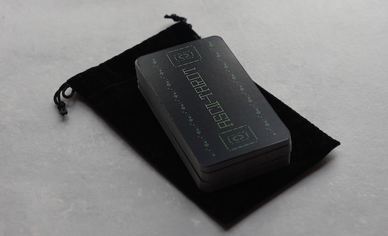

A CLI tool for tarot reading with full ASCII art deck \*:･ﾟ✧\*:･ﾟ✧

## Installation

`npm install -g ascii-tarot`

## Usage

`$ ascii-tarot`

Choose one card, three cards, or celtic cross. Reversed cards are possible.

## Buy the deck

IRL edition, limited print run: <a href="https://shop.ascii-tarot.com">shop.ascii-tarot.com</a>

## Contributing

This program was produced to support my personal magical practice and I am not particularly interested in expanding the feature set or modifying it (i.e. to include card interpretations, additional spreads, etc.) since I have been happy with it for some time.

However, if you want to modify it for your own personal magical practice you are of course free to fork this project and bend it to your will. Notable forks:

* [laurabreiman: no card repeats](https://github.com/laurabreiman/ascii-tarot/tree/unique-cards)
* [g-battaglia: added a five-card spread](https://github.com/g-battaglia/ascii-tarot)
* [jondi: daily card picks with card meanings, modified odds for reversed cards](https://github.com/Jondi/ascii-tarot-with-meanings)

I will be closing submissions for Pull Requests on this repo, but if you find this program is broken please do open an Issue. 

## License

The MIT License (see LICENSE.txt)

